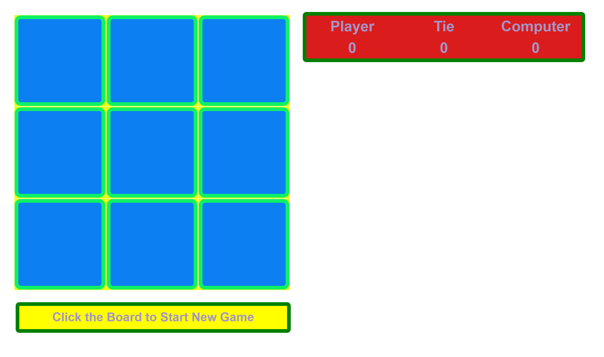

# React TicTacToe Game with Computer

 ## React TicTacToe Game with Computer
 
Tic-Tac-Toe is played on a square grid of 3×3 squares. Two players, compete against each other. They must each in turn fill in a square on the grid with the symbol assigned to them: O or X.

The winner is the one who manages to align three identical symbols, horizontally, vertically or diagonally.

Added features:
 
* Changed look of the page and Title
* Added Nav bar
* Reset button clears values

Other Stack features Used to build this app: CSS, HTML, JavaScripts, React hooks

Simple React Tictactoe Game against Computer

## Table of Contents 

* [Installation](#installation)
* [Prerequisites](#prerequisites)
* [Improvements](#improvements)
* [Technologies](#technologies)
* [Github Stats and License](#stats) 

## Installation:
>
>This application is compatible with the most commonly used web browsers.
>
>Quick Start:
> * git clone https://github.com/tictactoeGame/
> * cd tictactoeGame   
> * npm install
> * npm start
>
>Script Description:
> * cd command use to change the path to the atm files folder
> * npm start command starts webpack development server @ localhost:3000
>
> *Fork a repo:
>A fork is a copy of a repository. Forking a repository allows you to freely experiment with changes without affecting the original project.
> [How to Fork? Click here for the Instructions](https://docs.github.com/en/get-started/quickstart/fork-a-repo)
>
>

## Prerequisites:
* install React
* install npm
 
 
## Contact:  
 
- <a href="mailto:nileemashah@yahoo.com">Email Me </a>

- <a href="https://www.linkedin.com/feed/"> Connect Me </a> 

- <a href="https://github.com/NileemaS/NileemaS.github.io/blob/main/README.md">README for Bio </a>

## Improvements:

Future Improvements to add in the Reacttictactoe App
* Add player name
* set Timer to response
* maintainance

## Technologies:

    
    
    
    
    

 

  

    
  
## Stats:

 

### License ([^note]) 

[^note]:
    Copyrights @2022, All rights are reserved    
